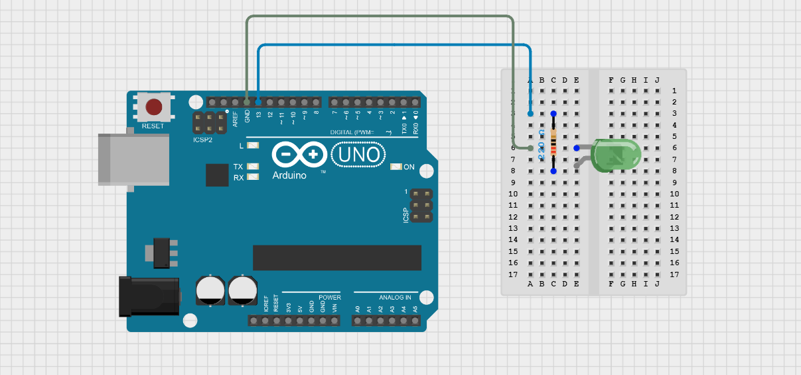
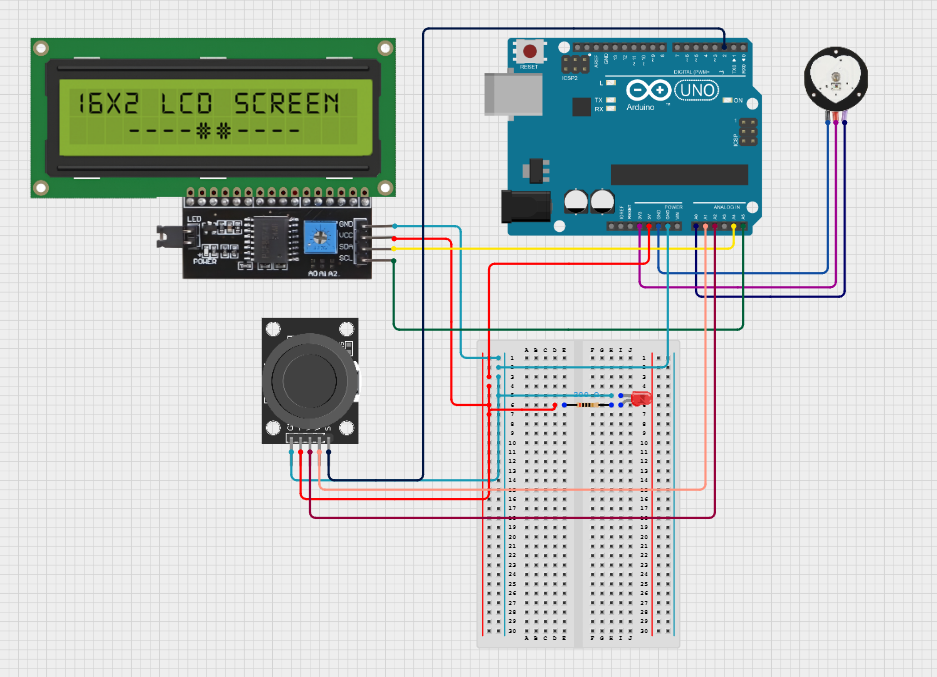

# BlueStamp Biometric Health Monitor
The biometric health monitor is able to check a person's heartbeat at any time as well as tracking the percentage of time in each exercise zone. There were many challenges like how I had no previous experience in coding or soldering. However, I learned to not give up and was able to complete the project.

| Alan B | Crocker Middle School | Electrical Engineering | Incoming 8th Grader


  
# Final Milestone

**Don't forget to replace the text below with the embedding for your milestone video. Go to Youtube, click Share -> Embed, and copy and paste the code to replace what's below.**

<iframe width="560" height="315" src="https://www.youtube.com/embed/F7M7imOVGug" title="YouTube video player" frameborder="0" allow="accelerometer; autoplay; clipboard-write; encrypted-media; gyroscope; picture-in-picture; web-share" allowfullscreen></iframe>

For your final milestone, explain the outcome of your project. Key details to include are:
- What you've accomplished since your previous milestone
- What your biggest challenges and triumphs were at BSE
- A summary of key topics you learned about
- What you hope to learn in the future after everything you've learned at BSE


# Second Milestone

<iframe width="914" height="514" src="https://www.youtube.com/embed/J7XCA21g0Ys?list=PLe-u_DjFx7eui8dmPGji-0-slT8KydYv_" title="Alan B. Milestone 2" frameborder="0" allow="accelerometer; autoplay; clipboard-write; encrypted-media; gyroscope; picture-in-picture; web-share" referrerpolicy="strict-origin-when-cross-origin" allowfullscreen></iframe>

# Description

After finishing my beats per minute, I immedietly started working on modifications. I first made it so it starts you off in a screen where you can choose within two options. However, I did not know how to choose between each option. I eventually decided on using a joystick (refer to figure 5) so you can move between options and press the button to confirm. The joystick has 5 wires, one of them is for ground, another is for the power and the other three track whats it's doing. For example, one wire tracks the x position(left and right) and another is responsible for the y position(up and down). This works because there is a potentiometer (refer to figure 6) that changes the current based off of where the joystick is facing. This is then interpreted to see where the joystick is. However, to change the amount of current it needs a potentiometer which works by using a wiper on a resistor track and moves the wiper depending on how much resistance is needed. For the button, when it is pressed, it completes an electrical circuit which tells the arduino whether or not it is pressed. I made another modification so that it makes the led light up if your heartbeat is over a certain level. I also added workout zones. There are 5 zones, 0-50% of your maximum heartrate, 50-60% and so on. Then, if you press the button again, it ends your exercise and shows you the percentage that you were in each zone. Once you are done, you can press the button again to restart it incase you want to use a different function like the BPM measurer. Now, the circuit is made up of an arduino, breadboard, pulse sensor, LCD, and joystick (refer to figure 3).

# Challenges

However, this milestone was the hardest one of them all. This was mainly because of the amount of coding that it required. For example, I spent an entire day of debugging trying to figure out why my code jsut skipped a screen. Then, I realized that one line of code should be placed 3 lines earlier than it was. Another time, I was wondering why half my code did not work when I found out that a bracket was paired wrong and it excluded the code. I also did not know too much code especially with arrays. Arrays are a list that can store data as elements which can be changed or read to see the value. I needed the array to store the amount of time in each zones. For example, if someone spent 3 second in zone 1, 5 seconds in zone 2, 3 seconds in zone 3, and 0 seconds in the other two zones, it would look like z[] = {3,5,3,0,0}. However, to change screens, I also had to use a variable that took a long time to debug since all the information of each screen corresponds to the value of the integer.

# Next Steps

Now that I am done with my coding, I am going to make a case so that it is portable and you can exercise with it. This will be done with a 3D printer. I will also need to first plan it on CAD before printing it.

# First Milestone

<iframe width="914" height="514" src="https://www.youtube.com/embed/a8BoErUSUk4?list=PLe-u_DjFx7eui8dmPGji-0-slT8KydYv_" title="Alan B. Milestone 1" frameborder="0" allow="accelerometer; autoplay; clipboard-write; encrypted-media; gyroscope; picture-in-picture; web-share" referrerpolicy="strict-origin-when-cross-origin" allowfullscreen></iframe>

# Description

The first thing that I did was learn how to code for the arduino. I started off by making a simple blinking light using a LED circuit (refer to figure 1).   

  
  Figure 1 - Circuit diagram of LED circuit
  
  Then, I learned how to code for the arduino. After, I believed I had enough knowledge to start building and coding the biometric health monitor. For the biometric health monitor, I used a pulse sensor (refer to figure 4), arduino uno, and a 16x2 LED display monitor. The pulse sensor detects when a heartbeat happens by tracing the amount of light that it produces and the amount of light absorbed. When, a heartbeat happens, blood flows and therefore less light ight is reflected. The pulse sensor detects that and counts it as a heartbeat and then counts the amount of heartbeats. It then sends a signal to the arduino which takes the average amount of heartbeats and converts it into the amount of heartbeats per minute. The display monitor then displays it so the user can read their heart rate. I was successful in coding and wiring the project to work (refer to figure 2). 

# Challenges

However, I faced many challenges. For example, I as a beginner in arduino coding and had no idea how analog pins work. I also had some trouble with the wiring and finding the right parts.

# Next Steps

Moving on, I will need to code more to detect high heartbeats, a buzzer to alert you about any problems with your heartbeat, and classify cardio zones. I plan to code the rest of the project in the next milestone and then put it together later to make it portable.


# Starter Milestone

<iframe width="1521" height="561" src="https://www.youtube.com/embed/PsNnBoVI7NY" title="Alan B. Starter Project" frameborder="0" allow="accelerometer; autoplay; clipboard-write; encrypted-media; gyroscope; picture-in-picture; web-share" referrerpolicy="strict-origin-when-cross-origin" allowfullscreen></iframe>

# Description

The RGB light is able to change into any color by changing the amount of red, green, and blue light outputted. I had no previous experience of soldering. However, this allowed me to learn more and gain experience on soldering through this project. There are three sliders that change the amount of red, green, and blue light is being emitted. There is also a LED with 4 prongs, one for ground, and 3 more for each color. There is also a port that allows you to connect it with a computer to provide battery.

# Challenges

For me, it was challenging in multiple ways. For example, I thought the longest wire was the positive side which although was true for most LED's, was not the case for the multi color one. Thus, I accidentally placed it the wrong way and fixed it later. I also never soldered before so I was kind of scared of having a 400 degrees celsius rod in my hands. However, I was able to finish the project successfuly.

# Next Steps

Now that I am done with my starter project, I will use the knowledge of circuits and soldering to make my intensive project. My intensive project is the biometric health monitor.

# Schematics 

  
  
  Figure 1 - Circuit diagram of LED circuit


  
  
  Figure 2 - Circuit diagram of pulse sensor and display monitor connected


  
  
  Figure 3 - Circuit diagram of joystick, LCD, and pulse sensor connected to the arduino


  

  Figure 4 - Pulse sensor schematic


  

  Figure 5 - Joystick schematic


  

  Figure 6 - Potentiometer schematic


# Code
Here's where you'll put your code. The syntax below places it into a block of code. Follow the guide [here]([url](https://www.markdownguide.org/extended-syntax/)) to learn how to customize it to your project needs. 


```cpp
void setup() {
  // initialize digital pin LED_12 as an output.
    pinMode(LED_12, OUTPUT);
  }

void loop() {
  digitalWrite(LED_12, HIGH);  // turn the LED on (HIGH is the voltage level)
  delay(1000);                      // wait for a second
  digitalWrite(LED_12, LOW);   // turn the LED off by making the voltage LOW
  delay(1000);                      
  }

```

# Bill of Materials
Here's where you'll list the parts in your project. To add more rows, just copy and paste the example rows below.
Don't forget to place the link of where to buy each component inside the quotation marks in the corresponding row after href =. Follow the guide [here]([url](https://www.markdownguide.org/extended-syntax/)) to learn how to customize this to your project needs. 

| **Part** | **Note** | **Price** | **Link** |
|:--:|:--:|:--:|:--:|
| Item Name | What the item is used for | $Price | <a href="https://www.amazon.com/Arduino-A000066-ARDUINO-UNO-R3/dp/B008GRTSV6/"> Link </a> |
| Item Name | What the item is used for | $Price | <a href="https://www.amazon.com/Arduino-A000066-ARDUINO-UNO-R3/dp/B008GRTSV6/"> Link </a> |
| Item Name | What the item is used for | $Price | <a href="https://www.amazon.com/Arduino-A000066-ARDUINO-UNO-R3/dp/B008GRTSV6/"> Link </a> |

# Other Resources/Examples
One of the best parts about Github is that you can view how other people set up their own work. Here are some past BSE portfolios that are awesome examples. You can view how they set up their portfolio, and you can view their index.md files to understand how they implemented different portfolio components.
- [Example 1](https://trashytuber.github.io/YimingJiaBlueStamp/)
- [Example 2](https://sviatil0.github.io/Sviatoslav_BSE/)
- [Example 3](https://arneshkumar.github.io/arneshbluestamp/)

To watch the BSE tutorial on how to create a portfolio, click here.```
